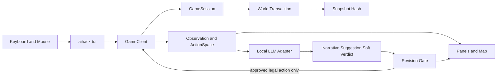

# AIHack Design Specification v2

> Archive chain
> - Latest: `.archive/designs_archive_260715.md`
> - Previous: first archive
>
> Phase 2~20의 화면·TUI 설계 이력은 아카이브에 있다. 이 문서는 v0.3.0 target만 정의한다.

문서 상태: active implemented design, report 20 active-state/false-green HOLD remediation pending re-audit
작성일: 2026-07-15
최근 동기화: 2026-07-22
기준: `spec.md`
관련 Task: R2-1, R5-2, R6-1..R6-3

## 1. 경험 목표

사용자는 로컬 LLM이 없어도 완전한 deterministic 로그라이크를 플레이할 수 있어야 한다. LLM을 켜면 다음 세 가지 presentation 기능만 추가된다.

1. 최근 사건을 1~240자로 요약한 narrative
2. 현재 `ActionSpace` 안에서 하나를 고르는 suggestion
3. 사용자가 서술한 시도에 대한 effect 없는 soft verdict

LLM은 이동, 전투, HP, RNG, inventory, score, save, replay를 직접 변경하지 않는다. suggestion도 사용자가 명시적으로 승인한 뒤 기존 `CommandIntent` 경로로 들어간다.

## 2. 현재 구현과 R8 release contract

| 영역 | 현재 v0.3.0 구현 | R8 release contract |
| --- | --- | --- |
| Game flow | Title, character creation, play, game over | 같은 흐름 수동 확인 |
| TUI | ratatui/crossterm workspace app, fixed panels | release binary에서 layout·입력 확인 |
| Narrative | loopback provider, timeout/status 표시 | provider disabled/degraded flow 확인 |
| Suggestion | request/revision gate + explicit approval | stale/invalid에서 submit 0회 확인 |
| 판정 | presentation-only soft verdict | core/save/replay 영향 0 확인 |
| state read | `GameClient`의 Observation/ActionSpace만 사용 | workspace boundary test 유지 |
| error | 상태별 텍스트와 재시도 CTA | release TUI에서 비색상 상태 구분 |
| accessibility | reduced motion/high contrast와 텍스트 badge | 수동 matrix 5개 확인 |

## 3. 구조



경계:

- `GameSession`은 UI node나 LLM request를 보관하지 않는다.
- TUI는 `Observation`, `ActionSpace`, `UiState`만 render한다.
- LLM adapter는 `SessionRevision { turn, snapshot_hash }`를 request/response에 복사한다.
- revision 불일치는 화면에 stale 상태로 표시하고 폐기한다.
- core event에서 UI effect를 투영할 수 있지만 UI effect가 core event를 만들지는 않는다.

## 4. 화면 흐름

```text
Title
  N or Enter
    -> CharacterCreation
         Enter
           -> Playing
                I -> Inventory overlay -> Esc -> Playing
                F9 -> Debug overlay -> F9 -> Playing
                G -> Narrative request -> Playing
                A -> Suggestion request -> SuggestionReady
                       Y -> current legal action submit -> Playing
                       N or Esc -> dismiss -> Playing
                J -> SoftJudgment input -> result -> Playing
                death -> GameOver
                          N -> Title
                          Q -> Exit
```

LLM 요청 중에도 core input은 block하지 않는다. 요청 뒤 turn이 진행되면 도착한 응답은 `Stale`이며 자동 표시나 실행을 하지 않는다.

## 5. Play 화면

### 5.1 120x36 이상

```text
┌ AIHack ─ Dungeon main:1 ─ Turn 0042 ─ Hash ab12cd34ef56ab78 ┐
│ Message / Narrative [LLM: Ready]                             │
├───────────────────────────────────────┬──────────────────────┤
│                                       │ Player               │
│               MAP                     │ HP 14/20  AC 3       │
│                                       │ Hunger Normal        │
│                                       ├──────────────────────┤
│                                       │ Inspect / Inventory  │
│                                       │                      │
├───────────────────────────────────────┴──────────────────────┤
│ [G] Narrative  [A] Suggest  [J] Judge  [I] Inventory  [F9] AI│
│ LLM result: none                                             │
└──────────────────────────────────────────────────────────────┘
```

높이 배분:

- header 1행
- message/narrative 3행
- map/HUD body: 남은 높이 - 7행
- CTA 1행
- LLM result 2행

폭 배분:

- terminal width 120 이상: map 70%, side panel 30%
- 80..119: map 65%, side panel 35%
- 60..79: map 위, HUD 아래 수직 배치
- 60 미만 또는 높이 24 미만: core status와 “terminal requires 60x24”만 표시하고 clean input loop 유지

### 5.2 정보 우선순위

1. blocking prompt와 GameOver
2. player HP와 immediate danger
3. core message
4. map
5. action hint
6. LLM status/result
7. debug information

LLM 패널이 core prompt나 HP를 가리지 않는다.

### 5.3 New run reset

`GameOver`에서 N을 누르면 `new_seed = previous_seed.wrapping_add(1)`로 `GameSession::new(new_seed)`를 만들고 Title로 이동한다. 다음 N 또는 Enter에서 CharacterCreation으로 이동한다. world, turn, RNG, event log, outstanding LLM request, LLM result, hover, focus, modal, debug overlay를 초기화한다. theme, reduced-motion, high-contrast 설정은 유지한다. 기존 save/replay 파일은 삭제하거나 덮어쓰지 않는다.

## 6. CTA와 입력 계약

| ID | 표시 | 입력 | 활성 조건 | 결과 |
| --- | --- | --- | --- | --- |
| CTA-LLM-GENERATE | `[G] Narrative` | G | Playing, LLM enabled, outstanding narrative 없음 | `NarrativePending` |
| CTA-LLM-SUGGEST | `[A] Suggest` | A | Playing, ActionSpace 비어 있지 않음, outstanding suggestion 없음 | `SuggestionPending` |
| CTA-LLM-JUDGE | `[J] Judge` | J | Playing, LLM enabled | 최대 240자 입력 modal |
| CTA-LLM-APPLY | `[Y] Apply` | Y | current revision의 valid suggestion 존재 | normal `GameClient::submit` |
| CTA-LLM-DISMISS | `[N] Dismiss` | N 또는 Esc | suggestion/verdict/result 존재 | result만 제거 |
| CTA-LLM-RETRY | `[R] Retry` | R | Busy, Timeout 또는 Unavailable | 새 request ID로 같은 종류 재요청 |

규칙:

- 비활성 CTA는 dim 처리하되 이유를 footer에 텍스트로 표시한다.
- `Y`는 suggestion action을 현재 `ActionSpace`에서 다시 검증한다.
- `N`과 Esc는 core turn을 소비하지 않는다.
- narrative와 soft verdict는 apply CTA를 갖지 않는다.
- mouse click은 같은 CTA ID를 생성하며 별도 command path를 만들지 않는다.
- Pending에서 Dismiss는 request ID를 `ignored`로 표시하고 panel만 닫는다. blocking worker를 강제 종료하지 않으며 해당 kind는 응답 또는 deadline까지 재요청할 수 없다. ignored response는 표시·submit 없이 폐기한다.

## 7. LLM UI 상태

```rust
pub enum LlmUiStatus {
    Disabled,
    Connecting,
    Ready,
    Pending { kind: LlmRequestKind, request_id: String },
    Busy,
    Timeout { kind: LlmRequestKind },
    Unavailable,
    Invalid,
    Stale,
}
```

| 상태 | badge | 본문 | 허용 CTA |
| --- | --- | --- | --- |
| Disabled | `LLM: OFF` | `Local LLM disabled; core play is available.` | 설정 안내만 |
| Connecting | `LLM: ...` | `Connecting to 127.0.0.1.` | Dismiss |
| Ready | `LLM: READY` | 마지막 성공 시간 없음 | G, A, J |
| Pending | `LLM: WAIT` | 종류와 request ID 앞 8자 | Dismiss |
| Busy | `LLM: BUSY` | request queue 16개가 사용 중 | Retry, Dismiss |
| Timeout | `LLM: TIMEOUT` | 제한 500/1500/2000ms 표시 | Retry, Dismiss |
| Unavailable | `LLM: DOWN` | 연결 거부/transport 분류만 표시 | Retry, Dismiss |
| Invalid | `LLM: INVALID` | 응답 schema 또는 legal action 불일치 | Dismiss |
| Stale | `LLM: STALE` | 요청 turn과 현재 turn 표시 | Dismiss |

에러 원문, prompt, response body, endpoint credential은 기본 화면에 출력하지 않는다. debug overlay에도 response 원문은 넣지 않는다.

## 8. LLM 결과 표현

### 8.1 Narrative

```text
Narrative · turn 42
The corridor falls quiet as the jackal retreats.
```

- 1..=240 Unicode scalar chars
- 최대 2행, 넘으면 `…`
- `session_revision` 일치 시에만 표시
- event log, save, replay에 저장하지 않음

### 8.2 Suggestion

```text
Suggestion · turn 42 · confidence 0.72
Move East — the tile is visible and unoccupied.
[Y] Apply  [N] Dismiss
```

- action은 `ActionIntent` typed value다.
- rationale은 1..=160자다.
- confidence는 0.0..=1.0 표시용이며 실행 권한을 높이지 않는다.
- stale/invalid이면 action text 대신 상태 메시지만 표시한다.

### 8.3 Soft verdict

```text
Soft judgment · Neutral · SOCIAL_UNCERTAIN
The attempt is plausible, but no core rule effect is applied.
[N] Dismiss
```

- verdict: Favorable, Neutral, Unfavorable
- reason_code: `[A-Z0-9_]{1,32}`
- message: 1..=240자
- effect, modifier, dice, state patch field를 포함하지 않는다.

## 9. 데이터 연결

| UI 값 | 유일한 source |
| --- | --- |
| turn, hash | `SessionRevision` |
| map, entities, inventory, HP | `Observation` |
| 활성 command와 CTA apply 검사 | `ActionSpace` |
| core message | `GameEvent::Message` projection |
| narrative/suggestion/verdict | `LlmPresentationState` |
| request status | `LlmUiStatus` |
| hover/focus/overlay | `UiState` |

UI가 `GameWorld`의 field를 직접 읽으면 R2/R5 실패다.

### 9.1 R9 콘텐츠 인과 구조

```text
embedded TOML
    |
    v
ContentRegistry --validate/project--> typed runtime data
    |                                      |
    v                                      v
world bootstrap ----player/monster action----> semantic state delta
    ^                                      |
    |                                      v
spawn/drop/corpse <----combat/death---- downstream legality/status/score
```

주요 콘텐츠는 위 구조에서 producer와 consumer를 모두 가져야 한다. 단순 표시용 projection은 world mutation 권한을 갖지 않지만, simulation content로 선언된 값은 명령 전후 snapshot의 위치, HP, AC, nutrition, gold, score, run state, entity lifecycle 중 하나를 바꿔야 한다. turn, event count, last event만 바뀐 경우는 인과 연결로 인정하지 않는다.

음식과 시체는 inventory selection을 거쳐 Eat 명령으로 소비되고 nutrition과 hunger state를 바꾼다. armor bonus와 monster behavior 값은 content registry에서 typed entity data로 전달되어야 한다. 가격은 후속 score/economy 계산에 사용한다. 상세 orphan register는 `docs/audit/audit_report_22.md`를 따른다.

## 10. 상태와 오류 처리

- terminal resize: 다음 frame에서 layout 재계산; core turn 불변
- provider disabled: LLM CTA 비활성, 게임 입력 유지
- connection refused: 1회 실패 후 자동 재시도 없음
- request queue full: Busy 표시, 새 요청 enqueue 없음
- timeout: 현재 요청 취소, Retry만 제공
- invalid JSON 또는 empty response: Invalid 표시, body 폐기
- stale response: Stale 표시 후 action 폐기
- rejected suggestion: current action space 재검증 결과 표시, submit 미호출
- invariant error: core error panel을 최상위로 표시하며 LLM 결과 숨김
- save/load error: typed error 요약과 경로만 표시하며 secret/path traversal detail 숨김
- TUI quick-save: 실행별 임시 directory 안의 `quick-save.json`만 사용하며 `ArtifactStore`의 no-follow·single-link·atomic replace 경계를 우회하지 않음

## 11. 접근성

- 색만으로 상태를 구분하지 않는다: OFF, WAIT, TIMEOUT, DOWN, INVALID, STALE 텍스트 사용
- high contrast에서 foreground/background contrast 목표 7:1
- reduced motion에서는 spinner 대신 `...` 고정 문자열 사용
- 모든 mouse CTA에 keyboard equivalent가 있다.
- focus 순서: map → HUD → inventory/inspect → LLM result → footer
- suggestion rationale와 verdict를 screen reader 친화적인 한 문장으로 유지한다.
- status 갱신은 core message를 덮어쓰지 않는다.
- key repeat는 LLM 요청 중복 생성에 사용하지 않는다.

## 12. 구현 제약

- render 함수는 `&Observation`, `&ActionSpace`, `&UiState`만 받는다.
- transport future/channel은 TUI app layer에 있고 core crate에 없다.
- 동시에 같은 종류의 outstanding request는 1개다.
- response queue 최대 16개; 초과 시 가장 오래된 presentation response를 버리고 core는 유지한다.
- 같은 CTA의 enqueue cooldown은 250ms이며 key repeat는 새 request를 만들지 않는다.
- endpoint host는 `127.0.0.1`, `localhost`, `[::1]`만 기본 허용한다.
- user text 240자, narrative 240자, rationale 160자, reason code 32자 제한을 render 이전에 검사한다.
- prompt injection text는 command로 parse하지 않는다.
- LLM result에 ANSI escape/control character를 허용하지 않는다.
- app exit는 terminal을 먼저 복원하고 request sender를 닫은 뒤 worker 종료 확인을 최대 250ms 기다린다. 250ms 안에 확인이 없으면 JoinHandle을 drop하고 process exit를 계속한다.

## 13. 검증

자동:

```bash
cargo test --workspace --locked --test ui_layout
cargo test --workspace --locked --test ui_input_mapping
cargo test --workspace --locked --test ui_runtime_smoke
cargo test --workspace --locked --test llm_revision_gate
cargo test --workspace --locked --test llm_soft_adjudication
```

수동 matrix:

| terminal | theme | motion | provider | 기대 |
| --- | --- | --- | --- | --- |
| 120x36 | default | normal | disabled | core play와 OFF badge |
| 80x24 | high contrast | reduced | success | 모든 CTA 텍스트 판독 |
| 60x24 | default | reduced | timeout | TIMEOUT과 Retry |
| 59x23 | default | normal | any | 최소 크기 안내, clean exit |
| 120x36 | high contrast | reduced | stale | STALE, submit 0회 |

완료 조건:

- 위 자동 test 전부 PASS
- 다섯 수동 case 전부 PASS
- 모든 LLM failure case에서 snapshot hash 불변
- CTA ID, input, 활성 조건, 결과가 코드 test 이름과 일치

## 14. R8 배포 표현 경계

런타임 TUI는 라이선스 승인이나 “공식 NetHack” 상태를 암시하는 badge를 추가하지 않는다. 배포 정체성은 실행 화면이 아니라 release bundle과 문서에서 다음처럼 고정한다.

| 산출물 | 필수 내용 | 생성·검증 경로 |
| --- | --- | --- |
| `LICENSE` | 공식 NetHack 3.6.7 `dat/license`와 동일한 NGPL 원문 | `scripts/r8_checkpoint.sh` SHA-256 검증 |
| `NOTICE` | NetHack 원 저작권, AI-assisted semantic rewrite 파생·수정 사실, 변경 기간 | R8 필수 문구 검증 |
| `PROJECT_OWNER_LICENSE_APPROVAL.md` | project-owner 승인 ID, 범위와 배포 경계 | metadata owner ID와 archive/output record 대조 |
| `MODIFICATIONS.md` | modification notice ID, 변경 기간과 path scope | metadata modification ID와 archive/output record 대조 |
| binary | `aihack`, `aihack-headless` | clean worktree의 release build |
| complete corresponding source | 해당 binary를 만든 동일 commit의 추적 source | `build.sh`/`build.bat`의 `git archive` |

`legacy_nethack_port_reference/`, `target/`, `output/`은 source archive에서 제외한다. release script는 untracked file을 포함해 worktree가 dirty하면 중단하므로 binary와 source commit의 불일치를 허용하지 않는다. 이 packaging 계약의 로컬 PASS는 독립 R8 감사나 외부 게시 승인을 뜻하지 않는다.
